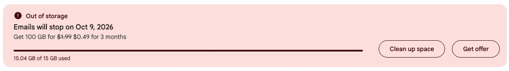

# Sweep

Have you been a long-time Google user and one day logged into Gmail only to find this dreaded message?



Fourteen years of newsletters. Every "your order has shipped." A 2017 video attachment of your Mom's new puppy because she hasn't quite figured out how to use cell phone just yet...

From my experience deleting clearing up space in Gmail can be a painful process. If you agree, today you're in luck.

<!-- TODO: the "after" — Sweep's gauge once the space is back, or a short GIF of Count → Trash all. -->

## What Sweep does

Sweep clears out years of Gmail in minutes. It runs on your own computer, talks straight to Gmail, and moves mail in batches of 1,000 instead of 50.

- **Count before you act.** Pick "Promotions older than a year." Sweep tells you email count, roughly how many GB, and who sent them before you touch anything.
- **Then trash it.** Tens of thousands of messages deleted with one button.
- **Changed your mind?** Undo. Every action is reversible right up until you empty the trash.
- **Build your own sweeps.** Older than 3 years, has an attachment over 10 MB. No Gmail search syntax required, though you can type it if you know it.

Nothing is stored anywhere. Your Gmail token lives in your browser and dies when you sign out.

## Get started

You'll need a Google Cloud project of your own. That sounds worse than it is: about ten minutes, once, and [SETUP.md](SETUP.md) walks you through every click. Google requires it because Sweep asks for the permission that can permanently delete mail, and Google does not hand that out to apps it hasn't audited.

Then:

```bash
uv tool install https://github.com/griffinsisk/sweep/releases/latest/download/sweep_gmail-0.2.0-py3-none-any.whl
export GOOGLE_CLIENT_ID=... GOOGLE_CLIENT_SECRET=...
sweep
```

Your browser opens. Sign in. Start counting.

## The part where you get your storage back

Moving mail to Trash frees nothing. Gmail keeps it for 30 days in case you regret it. The **Empty trash** button at the bottom is the one that gives you the gigabytes, and it is the one you can't undo, so Sweep makes you type it out.

After that, watch the gauge. Google takes a few minutes to admit the space is free.

## Optional: ask Claude

Set `ANTHROPIC_API_KEY` and a button appears on the senders list. Claude looks at who's been filling your inbox and says keep, unsubscribe, or trash, with a reason. It sees sender domains, counts, and a few subject lines. Never a message body. You still press the button.

## Should you use this?

**Yes, if** you have a personal Gmail that has quietly filled up over a decade and you'd rather spend ten minutes than a weekend.

**Probably not, if** you need to keep everything for legal or tax reasons, or you're on a Google Workspace account your admin controls. Sweep is a broom, not an archivist.

## Privacy, in one breath

Reads metadata, never bodies. Moves or deletes only what you click. Sends no email. Details in [PRIVACY.md](PRIVACY.md). Revoke access anytime at [myaccount.google.com/permissions](https://myaccount.google.com/permissions).

## What's next

Unsubscribe buttons for senders who support one-click, honest per-sender totals, a Claude check for "is there anything in here I should keep?", and an MCP server so Claude Desktop can run a cleanup for you. Issues and ideas welcome.

## License

MIT
